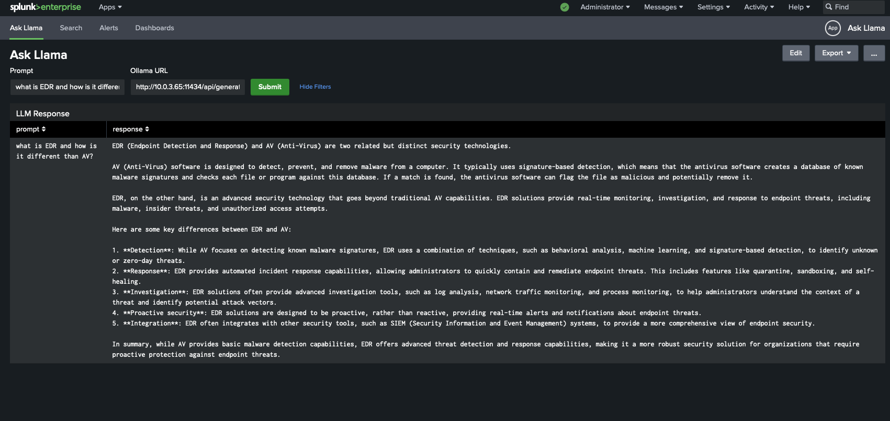
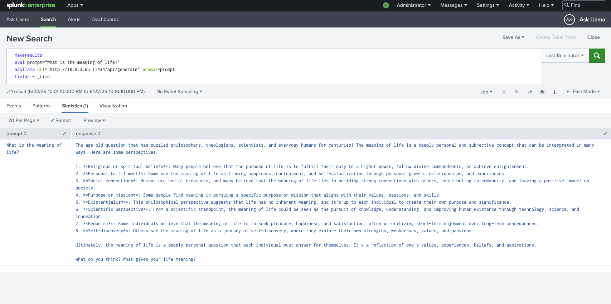
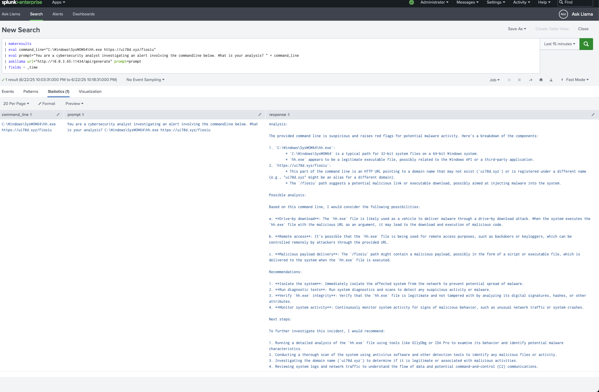

# Ask Llama
`askllama` is a simple command to chat with an LLM in Splunk with the Ollama API. Required options are `url` for the Ollama API such as `http://<IP>:11434/api/generate` and `prompt` which is a fieldname. See below for usage examples.
> The specific model used by this command can be changed in `askllama.py`, the default is llama3.2
# Demo

The above screenshot shows the app's main dashboard that allows you to chat with the Ollama API in GUI form.

---

This is the basic usage of the command.

---

This is an example of how you can concatenate fields to create a prompt for the LLM.

---
